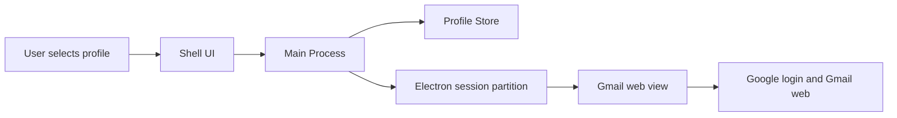

# Gmail Mac Client V1 Design

Date: 2026-05-08
Status: Approved for planning

## Summary

V1 is a single-window Electron app that runs Gmail as a dedicated Mac client. It keeps Gmail's web UI intact while adding one native convenience layer: manually created profiles with isolated Gmail sessions and a top account switcher.

The app is for personal productivity. Its first job is not to replace Gmail's interface, Gmail search, labels, compose flow, or sync model. Its first job is to remove browser-tab friction and Google account confusion by giving each Gmail account a separate app-managed profile.

## Goals

- Launch Gmail as a standalone Mac app without browser tabs, address bar, or bookmark UI.
- Let the user create named profiles such as `Work`, `Personal`, or `Test`.
- Keep each profile's Gmail login session isolated from the others.
- Let the user switch profiles from a compact top dropdown.
- Restore the last used profile when the app restarts.
- Keep Gmail internal navigation inside the app and open non-Gmail links in the default browser.

## Non-Goals

- Build a custom mail list, search, thread, or compose UI.
- Integrate directly with the Gmail API.
- Store Google passwords, OAuth tokens, or Google account credentials directly.
- Provide Dock unread badges in V1.
- Provide macOS new-mail notifications in V1.
- Provide AI summaries, classification, or reply drafting in V1.
- Support multiple simultaneous account windows in V1.
- Prepare for App Store distribution in V1.

## Product Shape

The app opens as a dedicated Gmail window. A slim app bar sits above the Gmail content. The app bar contains the current profile selector and profile management controls. The rest of the window is the Gmail web app.

On first launch, if no profiles exist, the app shows a small onboarding state that asks the user to create the first profile. The app only asks for a profile display name. After creation, it opens Gmail for that profile, and the user signs in through Google's normal web login flow.

Profiles are manually created and named by the user. Each profile maps to an isolated Electron session partition, so Google cookies, cache, and login state do not mix across profiles.

## Architecture

### Main Process

The Electron main process owns:

- App lifecycle.
- Main window creation.
- App menu and native shell behavior.
- Profile persistence.
- Electron session partition creation and cleanup.
- External link handling.

### Shell UI

The shell UI owns:

- First-run profile creation.
- Top app bar.
- Current profile dropdown.
- Profile creation, rename, and delete flows.
- Loading and error states around the Gmail view.

The shell UI must stay intentionally small. It should not recreate Gmail navigation or mail controls.

### Gmail View

The Gmail view loads `https://mail.google.com` using the selected profile's isolated session. Gmail remains responsible for:

- Login and 2FA.
- Inbox, labels, threads, search, compose, attachments, and settings.
- Gmail's own internal navigation.

### Profile Store

The profile store persists app metadata only:

- Profile id.
- Display name.
- Electron session partition name.
- Creation and update timestamps.
- Last active profile id.

The profile store must not directly store Google passwords, OAuth tokens, or copied Google credential material.

## Data Flow

When the user creates a profile, the app creates a profile record and a unique persistent session partition. The Gmail view then loads Gmail using that partition. The user signs in directly with Google. When the user later switches back to that profile, the same partition is reused, preserving its Gmail login state.

## UX States

### First Launch

If there are no profiles, show a focused first-run screen with:

- App name.
- A profile name field.
- A primary action to create the first Gmail profile.

After creation, load Gmail for the new profile.

### Main App

The main app has two regions:

- A compact top app bar with the current profile dropdown and profile management entry point.
- A Gmail content region that fills the rest of the window.

### Profile Dropdown

The dropdown supports:

- Viewing the current profile.
- Switching to another profile.
- Creating a new profile.
- Opening profile management.

V1 must preserve login session state across profile switches. Preserving the exact in-page Gmail view state, such as a search result or open thread, is a P1 enhancement if it cannot be done cleanly in the first implementation.

### Profile Management

Profile management supports:

- Renaming a profile.
- Deleting a profile.
- Adding a profile.

Deleting a profile should clearly communicate that the local Gmail session data for that profile may also be removed. The user must confirm deletion.

### Error States

The app should handle:

- Gmail load failure with a retry action.
- Network unavailability with a clear app-level message.
- Empty profile list by returning to first-launch profile creation.
- Profile delete failure with a retryable error.

## Navigation Rules

Gmail internal URLs should remain inside the app. Non-Gmail links opened from Gmail should open in the user's default browser.

V1 should treat the app as a Gmail client, not a general-purpose browser.

## Testing

Functional verification:

- First launch shows profile creation.
- Creating a profile opens Gmail login for that profile.
- Two profiles can be signed into different Google accounts.
- Switching profiles opens the correct Gmail session.
- Restarting the app restores the last used profile.
- Renaming a profile persists.
- Deleting a profile removes it from the profile list.
- Gmail links stay in the app.
- External links open in the default browser.

Technical verification:

- Each profile uses an isolated Electron session partition.
- App metadata does not contain Google passwords or OAuth tokens.
- Gmail login and 2FA work in the Electron environment.
- A macOS app build can be produced.

## Done Criteria

V1 is done when:

- The app launches from the Dock as an independent Mac app.
- Gmail is usable without browser chrome.
- The user can create at least two profiles.
- Each profile can maintain a distinct Gmail login session.
- The user can switch profiles through the top dropdown.
- Profile create, rename, and delete work.
- Last active profile is restored after restart.
- External navigation does not turn the app into a general browser.

## Open Questions For Implementation Planning

- Should the Gmail view be implemented with Electron `BrowserView`, `WebContentsView`, or another supported current Electron pattern?
- Should inactive profiles keep live web contents in memory for faster switching, or should V1 reload the selected profile's Gmail view on switch?
- What exact URL allowlist should count as Gmail or Google-account internal navigation?
- Which local storage library should be used for profile metadata?
- What app name and icon should be used for the first local build?
